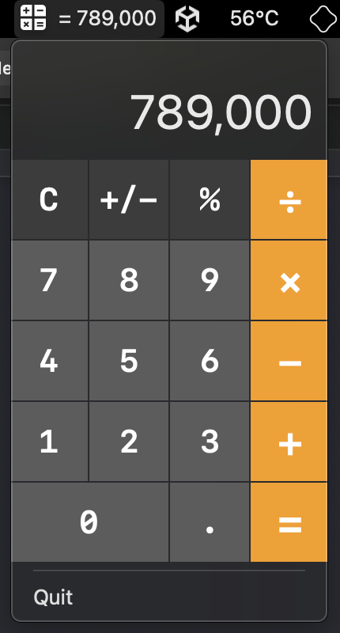

# MenuBarCalc

MenuBarCalc is a simple application developed for macOS. It was inspired by the default calculator app's limitation of not being able to be used with fullscreen apps. MenuBarCalc resolves this issue by appearing as a dropdown menu from the macOS Menu Bar whilst keeping the aesthetic of the default macOS calculator app.

# Features

- A calculator dropdown from the macOS Menu Bar
- Retains the aesthetic of the default macOS calculator app
- Keeps the last calculation result appearing on the Menu Bar

# Getting Started

## Install

1. Download the latest release from [here](https://github.com/jschoeny/MenuBarCalc/releases/latest)
2. Open the DMG and drag the app to your Applications folder
3. Because the app is not signed, you will need to Right-click the app and select Open. Then, click Open in the dialog box that appears.
4. The app will now appear in your Menu Bar.

## Usage

- `Left-click` to open the calculator dropdown
- `Right-click` to open the context menu (Open At Login, Quit)

# Release History

- 1.0.0
   - The first proper release

# License

Distributed under the MIT License. See [LICENSE](LICENSE) for more information.

# Support
Reach out to me at one of the following places!
- Website at [jschoeny.com](https://jschoeny.com) _(coming soon)_
- Twitter at [@jaredschoeny](http://twitter.com/jaredschoeny)

Don't forget to star the project if you find it useful!

# What's next
While this project is not a top priority for me, I am open to improving it and adding new features that I find useful. If you have any ideas or feedback, they are always welcome.
